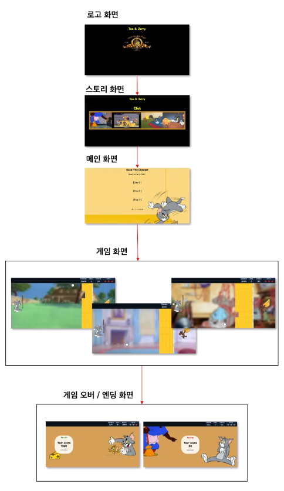

## 🧀 Save the Cheese! 🐭  

**“톰과 제리의 치즈 전쟁이 시작된다!”**  

### 🎮 게임 개요  
주인이 사 온 맛있는 치즈! 하지만 톰이 낮잠을 자는 사이 제리가 몰래 훔쳐간다.  
낮잠에서 깨어난 톰은 라켓과 공을 들고 치즈를 지키기 위해 제리를 쫓아간다!  
과연 톰은 모든 치즈를 지켜낼 수 있을까?  

---

### 🕹️ 게임 진행 방법  
1. **스토리 감상 또는 스킵**  
   - 첫 화면에서 로고 클릭 시 스토리 재생  
   - `Click` 버튼으로 메인 화면 이동 또는 `Skip` 버튼으로 바로 이동 가능  

2. **게임 시작 (Day 선택)**  
   - `Day 1`, `Day 2`, `Day 3` 중 선택하여 게임 진행  
   - `Option`에서 라켓과 공의 종류, 공 크기, 배경음악 설정 가능  

3. **게임 화면**  
   - 5초간 대기화면 → 본 게임 시작  
   - 톰(왼쪽) vs 제리(오른쪽) 대결!  
   - 톰이 라켓과 공을 이용해 치즈 장애물을 제거하며 진행  

4. **승리 & 패배 조건**  
   - **승리:** 모든 치즈 장애물 제거 → 다음 단계 진행  
   - **패배:** 공을 모두 소진하거나 남은 치즈 양이 0%가 되면 게임 오버  
   - `Day 3`에서 승리 시 엔딩 화면 출력  

---

### 🔧 주요 기능  
- **화면 이동**: `display: none/block` 전환 방식으로 구현  
- **게임 흐름**: 화면 간 이동 및 게임 진행 상태 유지  

💻 **기술 스택:** `HTML`, `CSS`, `JavaScript`  

👉 "Save the Cheese!"에서 톰과 함께 치즈를 지켜보세요! 🧀🐱🐭  

